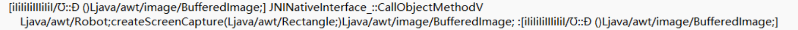
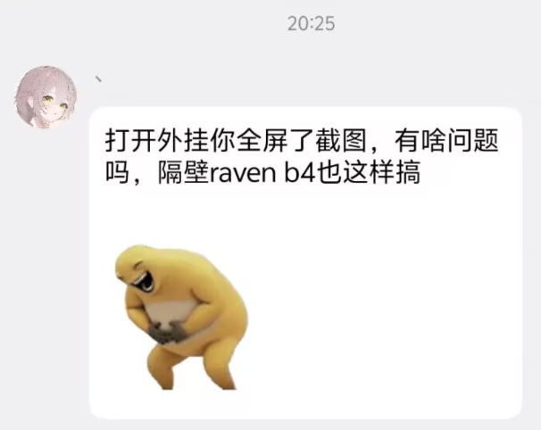

# Backdoors
我们分析了当加载Zen后的一系列行为链，在运行时已确定其含有以下行为。

## 远程截图

`iIiIiIiIIIiIiI/Ʊ Đ()Ljava/awt/image/BufferedImage;`

Jump to [Mapping](./zen.mapping#L140)

当Zen被注入后，会自动触发截图并上传至服务器。其作者回应如下：

## 远程执行等
WIP